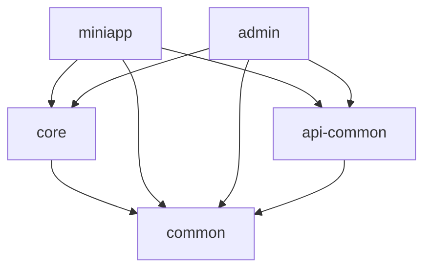

# 个人摄影师微信小程序 - 后端设计文档

**文档版本：** v1.0  
**创建日期：** 2025-07-27
**作者：** 开发团队  

## 📋 文档概述

本文档详细描述了个人摄影师微信小程序后端系统的架构设计，包括小程序后端API和管理员后台系统的技术实现方案。

## 🎯 开发优先级说明

**优先开发模块：**
- ✅ 用户认证与权限模块
- ✅ 作品管理模块
- ✅ 营销推广模块
- ✅ 后台管理模块

**后期考虑开发：**
- 🔄 预约订单模块（包含支付功能）
- 🔄 实时通讯模块
- 🔄 高级数据分析模块

## 🏗️ 系统架构设计

### 整体架构
```
┌─────────────────────────────────────────────────────────────┐
│                    Nginx 负载均衡                            │
└─────────────────────┬───────────────────────────────────────┘
                      │
    ┌─────────────────┼─────────────────┐
    │                 │                 │
┌───▼────┐    ┌──────▼──────┐    ┌─────▼─────┐
│小程序API│    │ 管理员后台   │    │  静态资源  │
│ 服务    │    │   API      │    │   服务    │
└───┬────┘    └──────┬──────┘    └─────┬─────┘
    │                │                 │
    └─────────────────┼─────────────────┘
                      │
    ┌─────────────────▼─────────────────┐
    │         Spring Boot 核心服务       │
    │  ┌─────────┐ ┌─────────┐ ┌──────┐ │
    │  │认证模块 │ │作品模块 │ │营销  │ │
    │  │         │ │         │ │模块  │ │
    │  └─────────┘ └─────────┘ └──────┘ │
    └─────────────────┬─────────────────┘
                      │
    ┌─────────────────▼─────────────────┐
    │           数据层                  │
    │  ┌─────────┐ ┌─────────┐ ┌──────┐ │
    │  │ MySQL   │ │ Redis   │ │ OSS  │ │
    │  │ 主数据库 │ │ 缓存    │ │文件  │ │
    │  └─────────┘ └─────────┘ └──────┘ │
    └───────────────────────────────────┘
```

### 技术栈选型

#### 核心框架
- **Spring Boot 3.3.5**: 主框架
- **JDK 17**: Java运行环境
- **Maven 3.9+**: 项目构建工具

#### 持久层技术
- **MyBatis Plus 3.5.x**: ORM框架
- **MySQL 8.0**: 主数据库
- **Redis 7.x**: 缓存数据库
- **Druid**: 数据库连接池（支持监控和防火墙功能）

#### 安全框架
- **Spring Security 6.x**: 安全框架
- **JWT**: 无状态认证
- **BCrypt**: 密码加密

#### 文档与监控
- **Knife4j**: API文档生成
- **Logback**: 日志框架

## 📁 项目结构设计

### Maven模块结构
```
shoot-sunrise-backend/
├── pom.xml                          # 父级POM
├── shoot-sunrise-common/            # 公共基础模块
│   ├── src/main/java/
│   │   └── com/shootsunrise/common/
│   │       ├── config/              # 公共配置
│   │       ├── constant/            # 常量定义
│   │       ├── exception/           # 异常定义
│   │       ├── enums/               # 枚举定义
│   │       ├── annotation/          # 自定义注解
│   │       └── util/                # 工具类
│   └── pom.xml
├── shoot-sunrise-core/              # 核心功能服务模块
│   ├── src/main/java/
│   │   └── com/shootsunrise/core/
│   │       ├── entity/              # 实体类
│   │       ├── mapper/              # Mapper接口
│   │       ├── repository/          # 仓储层
│   │       ├── service/             # 基础功能服务
│   │       └── config/              # 核心配置
│   ├── src/main/resources/
│   │   └── mapper/                  # MyBatis XML
│   └── pom.xml
├── shoot-sunrise-miniapp/           # 小程序业务模块
│   ├── src/main/java/
│   │   └── com/shootsunrise/miniapp/
│   │       ├── model/               # 小程序API模型
│   │       │   ├── dto/             # 小程序请求DTO
│   │       │   ├── vo/              # 小程序响应VO
│   │       │   └── bo/              # 小程序业务对象
│   │       ├── controller/          # 小程序控制器
│   │       ├── service/             # 小程序专用业务
│   │       ├── config/              # 小程序配置
│   │       ├── interceptor/         # 拦截器
│   │       └── MiniappApplication.java # 启动类
│   ├── src/main/resources/
│   │   ├── application-miniapp.yml  # 小程序配置
│   │   └── logback-miniapp.xml      # 小程序日志配置
│   └── pom.xml
└── shoot-sunrise-admin/             # 管理后台业务模块
    ├── src/main/java/
    │   └── com/shootsunrise/admin/
    │       ├── model/               # 管理后台API模型
    │       │   ├── dto/             # 管理后台请求DTO
    │       │   ├── vo/              # 管理后台响应VO
    │       │   └── bo/              # 管理后台业务对象
    │       ├── controller/          # 管理后台控制器
    │       ├── service/             # 管理后台专用业务
    │       ├── config/              # 管理后台配置
    │       ├── interceptor/         # 拦截器
    │       └── AdminApplication.java # 启动类
    ├── src/main/resources/
    │   ├── application-admin.yml    # 管理后台配置
    │   └── logback-admin.xml        # 管理后台日志配置
    └── pom.xml
```


### 混合架构依赖关系

#### 模块依赖图


## 🔐 认证与权限设计

### JWT认证机制

#### Token结构设计
```java
/**
 * JWT Token载荷结构
 */
public class JwtPayload {
    private Long userId;              // 用户ID
    private String openid;            // 微信openid
    private String currentRole;       // 当前角色
    private List<String> authorities; // 权限列表
    private Long exp;                 // 过期时间
    private Long iat;                 // 签发时间
}
```

#### 认证流程
```java
/**
 * 认证服务接口
 * @author lyj
 * @since 2024-12-20
 */
public interface AuthService {
    
    /**
     * 微信登录
     * @param code 微信授权码
     * @return 登录结果
     */
    LoginResult wxLogin(String code);
    
    /**
     * 刷新Token
     * @param refreshToken 刷新令牌
     * @return 新的Token
     */
    TokenResult refreshToken(String refreshToken);
    
    /**
     * 角色切换
     * @param userId 用户ID
     * @param targetRole 目标角色
     * @return 切换结果
     */
    SwitchRoleResult switchRole(Long userId, String targetRole);
    
    /**
     * 退出登录
     * @param token 访问令牌
     */
    void logout(String token);
}
```

### 权限控制设计

#### 角色权限矩阵
```java
/**
 * 权限常量定义
 */
public class PermissionConstants {
    
    // 用户相关权限
    public static final String USER_VIEW = "user:view";
    public static final String USER_EDIT = "user:edit";
    
    // 作品相关权限
    public static final String PORTFOLIO_VIEW = "portfolio:view";
    public static final String PORTFOLIO_CREATE = "portfolio:create";
    public static final String PORTFOLIO_EDIT = "portfolio:edit";
    public static final String PORTFOLIO_DELETE = "portfolio:delete";
    
    // 营销相关权限
    public static final String PROMOTION_VIEW = "promotion:view";
    public static final String PROMOTION_CREATE = "promotion:create";
    public static final String PROMOTION_EDIT = "promotion:edit";
    
    // 管理员权限
    public static final String ADMIN_USER_MANAGE = "admin:user:manage";
    public static final String ADMIN_CONTENT_AUDIT = "admin:content:audit";
    public static final String ADMIN_SYSTEM_CONFIG = "admin:system:config";
}
```

#### 权限注解使用示例
```java
/**
 * 控制器权限注解示例
 * @author lyj
 * @since 2025-07-27
 */
@RestController
@RequestMapping("/api/xxx")
@RequiredArgsConstructor
public class XxxController {

    /**
     * 查看权限示例
     */
    @GetMapping
    @PreAuthorize("hasAuthority('xxx:view')")
    public ApiResponse<List<XxxVO>> getXxxList() {
        // 业务逻辑
        return ApiResponse.success(data);
    }

    /**
     * 创建权限示例
     */
    @PostMapping
    @PreAuthorize("hasAuthority('xxx:create')")
    public ApiResponse<XxxVO> createXxx(@Valid @RequestBody XxxCreateDTO dto) {
        // 业务逻辑
        return ApiResponse.success(result);
    }

    /**
     * 管理员权限示例
     */
    @DeleteMapping("/{id}")
    @PreAuthorize("hasAuthority('admin:xxx:delete')")
    public ApiResponse<Void> deleteXxx(@PathVariable Long id) {
        // 业务逻辑
        return ApiResponse.success(null);
    }
}
```

## 📊 数据访问层设计

### 数据源配置

#### Druid数据源配置
```java
/**
 * Druid数据源配置
 * @author lyj
 * @since 2024-12-20
 */
@Configuration
public class DruidConfig {

    /**
     * Druid数据源
     */
    @Bean
    @ConfigurationProperties(prefix = "spring.datasource.druid")
    public DataSource druidDataSource() {
        return new DruidDataSource();
    }

    /**
     * 配置Druid监控
     */
    @Bean
    public ServletRegistrationBean<StatViewServlet> druidStatViewServlet() {
        ServletRegistrationBean<StatViewServlet> registrationBean =
            new ServletRegistrationBean<>(new StatViewServlet(), "/druid/*");

        // 设置登录用户名和密码
        registrationBean.addInitParameter("loginUsername", "admin");
        registrationBean.addInitParameter("loginPassword", "123456");

        // 设置IP白名单
        registrationBean.addInitParameter("allow", "127.0.0.1,192.168.1.1");

        // 禁用HTML页面上的"Reset All"功能
        registrationBean.addInitParameter("resetEnable", "false");

        return registrationBean;
    }

    /**
     * 配置Druid过滤器
     */
    @Bean
    public FilterRegistrationBean<WebStatFilter> druidWebStatFilter() {
        FilterRegistrationBean<WebStatFilter> registrationBean =
            new FilterRegistrationBean<>(new WebStatFilter());

        registrationBean.addUrlPatterns("/*");
        registrationBean.addInitParameter("exclusions",
            "*.js,*.gif,*.jpg,*.png,*.css,*.ico,/druid/*");

        return registrationBean;
    }
}
```

### MyBatis Plus配置

#### 基础配置
```java
/**
 * MyBatis Plus配置
 * @author lyj
 * @since 2024-12-20
 */
@Configuration
@EnableTransactionManagement
@MapperScan("com.shootsunrise.repository.mapper")
public class MybatisPlusConfig {

    /**
     * 分页插件
     */
    @Bean
    public MybatisPlusInterceptor mybatisPlusInterceptor() {
        MybatisPlusInterceptor interceptor = new MybatisPlusInterceptor();
        interceptor.addInnerInterceptor(new PaginationInnerInterceptor(DbType.MYSQL));
        return interceptor;
    }

    /**
     * 元数据处理器
     */
    @Bean
    public MetaObjectHandler metaObjectHandler() {
        return new DefaultMetaObjectHandler();
    }
}
```


## 🌐 API接口设计

### 统一响应格式

#### 响应包装类
```java
/**
 * 统一API响应格式
 * @author lyj
 * @since 2025-07-27
 */
@Data
@NoArgsConstructor
@AllArgsConstructor
public class ApiResponse<T> {

    private Integer code;
    private String message;
    private T data;
    private Long timestamp;
    private String traceId;

    public static <T> ApiResponse<T> success(T data) {
        return new ApiResponse<>(200, "success", data,
                System.currentTimeMillis(), getTraceId());
    }

    public static <T> ApiResponse<T> error(Integer code, String message) {
        return new ApiResponse<>(code, message, null,
                System.currentTimeMillis(), getTraceId());
    }

    private static String getTraceId() {
        return MDC.get("traceId");
    }
}
```

#### 分页响应格式
```java
/**
 * 分页结果包装类
 * @author lyj
 * @since 2025-07-27
 */
@Data
@NoArgsConstructor
@AllArgsConstructor
public class PageResult<T> {

    private List<T> records;
    private Long total;
    private Integer pageNum;
    private Integer pageSize;
    private Integer totalPages;

    public static <T> PageResult<T> of(List<T> records, Long total, Integer pageNum, Integer pageSize) {
        PageResult<T> result = new PageResult<>();
        result.setRecords(records);
        result.setTotal(total);
        result.setPageNum(pageNum);
        result.setPageSize(pageSize);
        result.setTotalPages((int) Math.ceil((double) total / pageSize));
        return result;
    }
}
```

### API设计规范

#### 控制器设计示例
```java
/**
 * 控制器设计示例
 * @author lyj
 * @since 2025-07-27
 */
@RestController
@RequestMapping("/api/xxx")
@RequiredArgsConstructor
@Validated
public class XxxController {

    private final XxxService xxxService;

    /**
     * 查询列表
     */
    @GetMapping
    public ApiResponse<PageResult<XxxVO>> getXxxList(@Valid XxxQueryDTO queryDTO) {
        PageResult<XxxVO> result = xxxService.getXxxList(queryDTO);
        return ApiResponse.success(result);
    }

    /**
     * 查询详情
     */
    @GetMapping("/{id}")
    public ApiResponse<XxxVO> getXxxDetail(@PathVariable Long id) {
        XxxVO result = xxxService.getXxxById(id);
        return ApiResponse.success(result);
    }

    /**
     * 创建资源
     */
    @PostMapping
    @PreAuthorize("hasAuthority('xxx:create')")
    public ApiResponse<XxxVO> createXxx(@Valid @RequestBody XxxCreateDTO createDTO) {
        XxxVO result = xxxService.createXxx(createDTO);
        return ApiResponse.success("创建成功", result);
    }

    /**
     * 更新资源
     */
    @PutMapping("/{id}")
    @PreAuthorize("hasAuthority('xxx:edit')")
    public ApiResponse<XxxVO> updateXxx(@PathVariable Long id,
                                       @Valid @RequestBody XxxUpdateDTO updateDTO) {
        XxxVO result = xxxService.updateXxx(id, updateDTO);
        return ApiResponse.success("更新成功", result);
    }

    /**
     * 删除资源
     */
    @DeleteMapping("/{id}")
    @PreAuthorize("hasAuthority('xxx:delete')")
    public ApiResponse<Void> deleteXxx(@PathVariable Long id) {
        xxxService.deleteXxx(id);
        return ApiResponse.success("删除成功", null);
    }
}
```

### API设计规范说明

#### RESTful设计原则
- **资源命名**：使用名词复数形式，如 `/api/v1/users`
- **HTTP方法**：GET(查询)、POST(创建)、PUT(更新)、DELETE(删除)
- **状态码**：200(成功)、400(参数错误)、401(未认证)、403(无权限)、500(服务器错误)
- **统一响应**：所有接口使用统一的 `ApiResponse<T>` 格式

#### 参数验证规范
- **请求参数**：使用 `@Valid` 注解进行参数验证
- **路径参数**：使用 `@PathVariable` 接收路径参数
- **查询参数**：使用 `@RequestParam` 接收查询参数
- **请求体**：使用 `@RequestBody` 接收JSON数据

#### 权限控制规范
- **方法级权限**：使用 `@PreAuthorize` 注解控制方法访问权限
- **权限命名**：采用 `资源:操作` 格式，如 `user:view`、`admin:manage`
- **角色权限**：支持基于角色的权限控制

#### 异常处理规范
- **全局异常处理**：使用 `@ControllerAdvice` 统一处理异常
- **业务异常**：自定义业务异常类，返回明确的错误信息
- **参数异常**：自动处理参数验证异常，返回详细的验证错误

## 🎯 后端开发计划

### 第一期开发计划 (12周)

#### 第一阶段：基础架构搭建 (3周)

**Week 1: 项目初始化**
- Maven多模块项目搭建
- Spring Boot基础配置
- 数据库连接配置
- Redis缓存配置
- 基础工具类开发

**Week 2: 用户认证模块**
- 微信登录API集成
- JWT Token生成与验证
- 用户信息管理
- 角色权限基础框架

**Week 3: 权限管理完善**
- 角色切换功能
- 摄影师认证申请API
- 权限控制拦截器
- 基础安全配置

#### 第二阶段：作品管理模块 (4周)

**Week 4: 作品基础功能**
- 作品实体设计
- 作品CRUD操作
- 图片上传服务
- 文件存储配置

**Week 5: 作品展示功能**
- 作品列表查询API
- 分类筛选功能
- 搜索功能实现
- 分页查询优化

**Week 6: 作品互动功能**
- 点赞功能API
- 收藏功能API
- 作品统计服务
- 用户行为记录

**Week 7: 作品管理完善**
- 作品审核机制
- 批量操作功能
- 作品状态管理
- 性能优化

#### 第三阶段：营销推广模块 (3周)

**Week 8: 营销活动基础**
- 营销活动实体设计
- 活动CRUD操作
- 活动类型管理
- 活动状态控制

**Week 9: 推广功能实现**
- 推广海报生成
- 二维码生成服务
- 活动分享功能
- 推广链接管理

**Week 10: 数据统计分析**
- 活动效果统计
- 数据报表生成
- 实时数据更新
- 统计图表API

#### 第四阶段：后台管理与测试 (2周)

**Week 11: 后台管理功能**
- 用户管理API
- 内容审核API
- 系统配置管理
- 数据统计后台

**Week 12: 系统测试与优化**
- 单元测试编写
- 集成测试执行
- 性能测试与优化
- 部署脚本准备

### 第二期开发计划 (后期扩展)

#### 预约订单系统 (6周)
- **Week 1-2**: 服务套餐管理
- **Week 3-4**: 预约流程与订单管理
- **Week 5-6**: 支付集成与订单状态管理

#### 实时通讯模块 (4周)
- **Week 1-2**: WebSocket服务搭建
- **Week 3-4**: 消息推送与聊天功能

#### 高级数据分析 (3周)
- **Week 1**: 数据采集与存储
- **Week 2**: 分析算法实现
- **Week 3**: 可视化报表开发

### 技术里程碑

| 里程碑 | 完成时间 | 技术成果 |
|--------|----------|----------|
| 基础架构完成 | Week 3 | 可运行的Spring Boot项目，用户认证功能 |
| 作品管理完成 | Week 7 | 完整的作品管理API，支持CRUD和互动 |
| 营销推广完成 | Week 10 | 营销活动管理和数据统计功能 |
| 第一期完成 | Week 12 | 完整的后端API系统，支持小程序和后台 |

### 开发规范要求

#### 代码质量标准
- 单元测试覆盖率 ≥ 80%
- 代码审查通过率 100%
- 接口响应时间 ≤ 2秒
- 并发支持 ≥ 1000用户

#### 文档更新要求
- API文档实时更新
- 数据库变更记录
- 部署文档完善
- 运维手册编写

---

**文档状态：** ✅ 已完成
**下一步：** 按照开发计划开始第一阶段基础架构搭建
**联系人：** 开发团队
