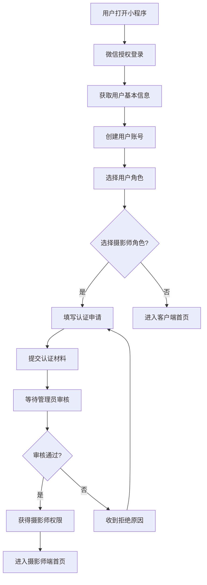
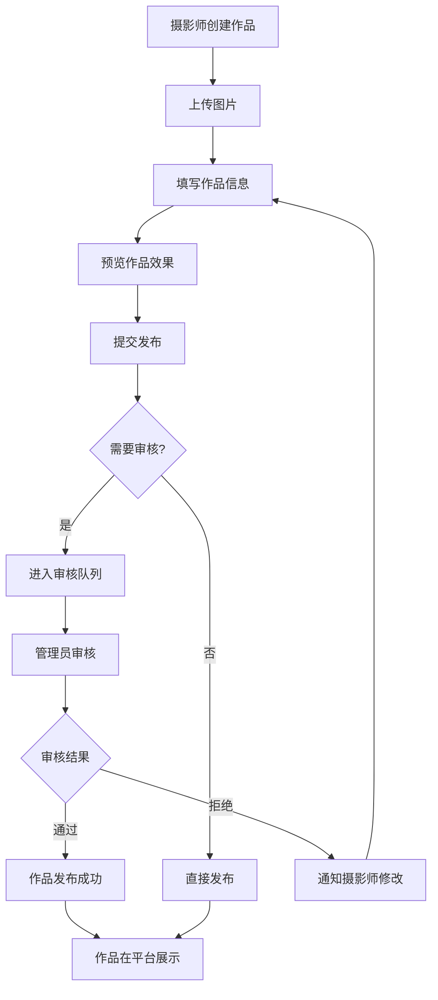
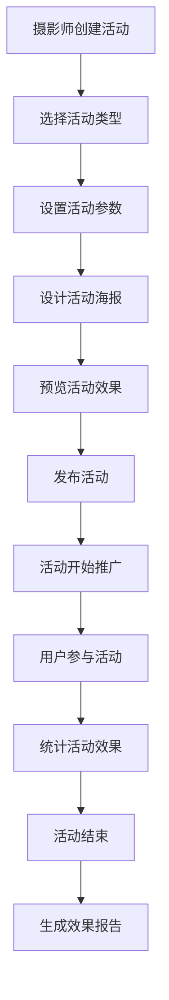

# 个人摄影师微信小程序 - 详细需求文档

**文档版本：** v1.0  
**创建日期：** 2025-07-27
**作者：** 开发团队  

## 📋 文档概述

本文档详细描述了个人摄影师微信小程序的功能需求、业务流程、用户故事、验收标准等，为产品开发提供全面的需求指导。

## 🎯 项目背景与目标

### 项目背景
随着移动互联网的发展和人们对个性化摄影服务需求的增长，传统的摄影师获客方式已无法满足市场需求。本项目旨在打造一个连接摄影师与客户的专业平台，通过微信小程序的便捷性，为双方提供高效的服务对接。

### 项目目标
- **为摄影师提供**：作品展示平台、客户获取渠道、营销推广工具
- **为客户提供**：优质摄影师发现、作品浏览体验、便捷预约服务
- **为平台提供**：内容管理工具、用户管理系统、数据分析能力

### 目标用户群体

#### 主要用户群体
1. **个人摄影师**
   - 年龄：25-45岁
   - 特征：有一定摄影技能，希望扩大客户群体
   - 需求：展示作品、获取客户、提升知名度

2. **摄影爱好者客户**
   - 年龄：20-40岁
   - 特征：有摄影需求，追求个性化服务
   - 需求：找到合适摄影师、查看作品案例、便捷预约

3. **平台管理员**
   - 角色：运营人员、内容审核员、客服人员
   - 需求：用户管理、内容审核、数据分析

## 🎯 开发优先级说明

### 第一期开发（核心功能）
**优先级：高**
- ✅ 用户认证与权限管理
- ✅ 作品展示与管理
- ✅ 营销推广功能
- ✅ 后台管理系统

### 第二期开发（增值功能）
**优先级：中**
- 🔄 预约订单系统（包含支付功能）
- 🔄 实时通讯模块

### 第三期开发（扩展功能）
**优先级：低**
- 📋 高级数据分析
- 📋 AI推荐算法
- 📋 社交分享功能

## 📱 功能需求详述

### 1. 用户认证与权限管理

#### 1.1 微信登录
**功能描述：** 用户通过微信授权快速登录小程序

**用户故事：**
- 作为用户，我希望能够通过微信一键登录，无需注册繁琐的账号
- 作为用户，我希望登录后能保持登录状态，下次打开小程序无需重复登录

**功能流程：**
1. 用户点击"微信登录"按钮
2. 调用微信授权API获取用户基本信息
3. 后端验证微信授权码，创建或更新用户信息
4. 返回JWT Token，前端保存登录状态
5. 跳转到首页或用户指定页面

**验收标准：**
- [ ] 用户能够通过微信授权成功登录
- [ ] 登录后能够获取用户基本信息（昵称、头像）
- [ ] 登录状态能够持久化保存
- [ ] 登录失败时有明确的错误提示
- [ ] 支持游客模式浏览部分内容

**技术要求：**
- 使用微信小程序登录API
- JWT Token有效期设置为7天
- 支持Token自动刷新机制
- 敏感操作需要重新验证身份

#### 1.2 角色切换
**功能描述：** 用户可以在客户和摄影师身份之间自由切换

**用户故事：**
- 作为摄影师，我希望能够切换到客户身份，浏览其他摄影师的作品
- 作为客户，我希望能够申请成为摄影师，展示自己的作品

**功能流程：**
1. 用户在个人中心点击"角色切换"
2. 选择目标角色（客户/摄影师）
3. 如果切换到摄影师角色且未认证，引导用户进行认证
4. 更新用户当前角色状态
5. 刷新页面内容，显示对应角色的功能

**验收标准：**
- [ ] 用户能够在两种角色间自由切换
- [ ] 切换后页面内容和功能相应变化
- [ ] 摄影师角色需要通过认证才能使用完整功能
- [ ] 角色状态能够持久化保存

#### 1.3 摄影师认证
**功能描述：** 用户申请成为认证摄影师，提交相关资料等待审核

**用户故事：**
- 作为摄影爱好者，我希望能够申请成为认证摄影师，展示我的作品
- 作为平台管理员，我希望能够审核摄影师申请，确保平台质量

**功能流程：**
1. 用户填写摄影师认证申请表
2. 上传身份证明、作品样例等材料
3. 提交申请，状态变为"待审核"
4. 管理员在后台审核申请材料
5. 审核通过后，用户获得摄影师权限
6. 审核拒绝时，用户收到拒绝原因，可重新申请

**验收标准：**
- [ ] 申请表单包含必要的信息字段
- [ ] 支持上传多种格式的证明材料
- [ ] 申请状态实时更新并通知用户
- [ ] 管理员能够高效审核申请
- [ ] 审核结果有详细的反馈信息

### 2. 作品展示与管理

#### 2.1 作品发布
**功能描述：** 摄影师可以发布自己的摄影作品，包括图片、描述、标签等信息

**用户故事：**
- 作为摄影师，我希望能够轻松上传和发布我的摄影作品
- 作为摄影师，我希望能够为作品添加详细的描述和标签，方便客户发现

**功能流程：**
1. 摄影师点击"发布作品"按钮
2. 选择并上传作品图片（支持多张）
3. 填写作品信息（标题、描述、分类、标签等）
4. 设置作品属性（是否公开、是否精选等）
5. 预览作品效果
6. 提交发布，等待审核（可选）

**验收标准：**
- [ ] 支持上传多张高质量图片
- [ ] 图片自动压缩和格式转换
- [ ] 支持添加水印保护
- [ ] 作品信息表单验证完整
- [ ] 支持草稿保存功能
- [ ] 发布后能够正常展示

**技术要求：**
- 支持JPG、PNG、WEBP格式
- 单张图片大小限制10MB
- 单个作品最多20张图片
- 自动生成缩略图
- 支持图片懒加载

#### 2.2 作品浏览
**功能描述：** 用户可以浏览平台上的摄影作品，支持分类筛选、搜索等功能

**用户故事：**
- 作为客户，我希望能够浏览各种风格的摄影作品，寻找灵感
- 作为客户，我希望能够通过分类和搜索快速找到我需要的作品类型

**功能流程：**
1. 用户进入作品浏览页面
2. 选择作品分类或使用搜索功能
3. 浏览作品列表，支持瀑布流或网格布局
4. 点击作品查看详情
5. 支持点赞、收藏、分享等互动操作
6. 查看摄影师信息，可直接联系

**验收标准：**
- [ ] 作品列表加载流畅，支持分页
- [ ] 分类筛选功能完整准确
- [ ] 搜索功能响应快速，结果相关
- [ ] 作品详情页信息完整
- [ ] 互动功能正常工作
- [ ] 支持图片放大查看

#### 2.3 作品管理
**功能描述：** 摄影师可以管理自己发布的作品，包括编辑、删除、统计等功能

**用户故事：**
- 作为摄影师，我希望能够管理我发布的所有作品
- 作为摄影师，我希望能够查看作品的浏览量、点赞数等统计数据

**功能流程：**
1. 摄影师进入"我的作品"页面
2. 查看所有已发布的作品列表
3. 对单个作品进行编辑、删除、隐藏等操作
4. 查看作品统计数据（浏览量、点赞数、收藏数）
5. 批量管理多个作品
6. 设置作品展示顺序

**验收标准：**
- [ ] 作品列表显示完整信息
- [ ] 编辑功能保持数据一致性
- [ ] 删除操作有确认提示
- [ ] 统计数据准确实时
- [ ] 批量操作功能正常
- [ ] 排序功能生效

### 3. 营销推广功能

#### 3.1 营销活动创建
**功能描述：** 摄影师可以创建各种营销活动，如折扣、满减、限时优惠等

**用户故事：**
- 作为摄影师，我希望能够创建营销活动来吸引更多客户
- 作为摄影师，我希望能够设置活动的时间、条件和优惠力度

**功能流程：**
1. 摄影师进入营销活动管理页面
2. 点击"创建活动"按钮
3. 选择活动类型（折扣、满减、赠品等）
4. 设置活动参数（优惠力度、使用条件、时间范围）
5. 设计活动海报和宣传文案
6. 预览活动效果
7. 发布活动，开始推广

**验收标准：**
- [ ] 支持多种活动类型
- [ ] 活动参数设置灵活
- [ ] 海报生成功能完善
- [ ] 活动预览效果准确
- [ ] 发布后能够正常展示
- [ ] 活动状态管理完整

#### 3.2 活动推广
**功能描述：** 营销活动可以通过多种渠道进行推广，提高曝光度

**用户故事：**
- 作为摄影师，我希望我的营销活动能够被更多潜在客户看到
- 作为客户，我希望能够及时了解到感兴趣的摄影师的优惠活动

**功能流程：**
1. 活动在平台首页推荐位展示
2. 通过小程序分享功能传播活动
3. 生成活动专属二维码
4. 发送活动通知给关注的用户
5. 在摄影师个人页面突出显示
6. 统计活动推广效果

**验收标准：**
- [ ] 活动在多个位置正确展示
- [ ] 分享功能生成正确链接
- [ ] 二维码扫描跳转正确
- [ ] 通知推送及时准确
- [ ] 推广效果统计完整

#### 3.3 效果统计
**功能描述：** 提供详细的营销活动效果统计，帮助摄影师优化推广策略

**用户故事：**
- 作为摄影师，我希望能够了解营销活动的具体效果
- 作为摄影师，我希望能够根据数据调整我的营销策略

**功能流程：**
1. 摄影师查看活动统计报告
2. 分析活动参与人数、转化率等指标
3. 查看活动带来的收益情况
4. 对比不同活动的效果
5. 导出统计数据
6. 根据数据优化后续活动

**验收标准：**
- [ ] 统计数据准确完整
- [ ] 图表展示清晰易懂
- [ ] 支持多维度数据分析
- [ ] 数据导出功能正常
- [ ] 实时数据更新

### 4. 后台管理系统

> **注意：** 以下功能为第二期开发内容，暂不在第一期实现范围内：
> - 预约订单管理功能
> - 支付相关功能
> - 评价反馈系统
>
> 第一期主要实现用户管理、内容审核、系统配置等核心管理功能。

#### 4.1 用户管理
**功能描述：** 管理员可以管理平台上的所有用户，包括普通用户和摄影师

**用户故事：**
- 作为管理员，我希望能够查看和管理所有用户的信息
- 作为管理员，我希望能够处理用户投诉和违规行为

**功能流程：**
1. 管理员登录后台管理系统
2. 进入用户管理模块
3. 查看用户列表，支持搜索和筛选
4. 查看用户详细信息和活动记录
5. 对违规用户进行警告或封禁
6. 处理用户申诉和投诉
7. 生成用户统计报告

**验收标准：**
- [ ] 用户列表显示完整信息
- [ ] 搜索筛选功能准确
- [ ] 用户详情页信息全面
- [ ] 用户状态管理功能正常
- [ ] 操作日志记录完整
- [ ] 统计报告数据准确

#### 4.2 内容审核
**功能描述：** 管理员审核平台上的内容，确保内容质量和合规性

**用户故事：**
- 作为管理员，我希望能够审核用户发布的作品内容
- 作为管理员，我希望能够快速识别和处理违规内容

**功能流程：**
1. 系统自动标记需要审核的内容
2. 管理员查看待审核内容列表
3. 逐一审核内容，判断是否合规
4. 对合规内容进行通过操作
5. 对违规内容进行拒绝并说明原因
6. 设置内容审核规则和标准
7. 生成审核统计报告

**验收标准：**
- [ ] 审核队列管理高效
- [ ] 审核操作界面友好
- [ ] 审核结果及时通知用户
- [ ] 审核规则配置灵活
- [ ] 审核记录可追溯
- [ ] 批量审核功能可用

#### 4.3 系统配置
**功能描述：** 管理员可以配置系统的各种参数和设置

**用户故事：**
- 作为管理员，我希望能够灵活配置系统参数
- 作为管理员，我希望能够管理系统的基础数据

**功能流程：**
1. 管理员进入系统配置模块
2. 配置基础参数（上传限制、审核规则等）
3. 管理作品分类和标签
4. 设置推荐算法参数
5. 配置消息模板和通知规则
6. 管理系统公告和帮助文档
7. 备份和恢复系统配置

**验收标准：**
- [ ] 配置项分类清晰
- [ ] 参数修改即时生效
- [ ] 配置变更有日志记录
- [ ] 支持配置导入导出
- [ ] 配置验证机制完善
- [ ] 回滚功能可用

## 📊 非功能性需求

### 性能要求
- **响应时间**：页面加载时间不超过3秒
- **并发用户**：支持1000个并发用户同时在线
- **图片加载**：图片压缩后大小不超过500KB
- **数据库查询**：复杂查询响应时间不超过2秒

### 安全要求
- **数据传输**：所有数据传输使用HTTPS加密
- **用户认证**：使用JWT Token进行身份验证
- **数据存储**：敏感数据加密存储
- **权限控制**：严格的角色权限管理

### 兼容性要求
- **微信版本**：支持微信7.0以上版本
- **操作系统**：支持iOS 10+和Android 6.0+
- **浏览器**：管理后台支持Chrome、Firefox、Safari最新版本

### 可用性要求
- **系统可用性**：99.5%以上
- **故障恢复**：系统故障后1小时内恢复
- **数据备份**：每日自动备份，保留30天
- **监控告警**：关键指标异常时自动告警

## 🔄 业务流程设计

### 用户注册与认证流程

### 作品发布与审核流程

### 营销活动创建流程

## 📋 用户故事详述

### Epic 1: 用户认证与权限管理

#### Story 1.1: 微信快速登录
**作为** 小程序用户
**我希望** 能够通过微信一键登录
**以便** 快速进入平台，无需记忆额外的账号密码

**验收标准：**
- 点击登录按钮后，能够调起微信授权页面
- 授权成功后，能够获取用户昵称和头像
- 登录状态能够保持7天
- 登录失败时有明确的错误提示

#### Story 1.2: 角色身份切换
**作为** 平台用户
**我希望** 能够在客户和摄影师身份之间切换
**以便** 根据不同需求使用不同功能

**验收标准：**
- 在个人中心能够看到角色切换入口
- 切换后页面内容和功能相应变化
- 切换到摄影师需要完成认证流程
- 角色状态能够持久化保存

#### Story 1.3: 摄影师认证申请
**作为** 摄影爱好者
**我希望** 能够申请成为认证摄影师
**以便** 在平台上展示作品和获取客户

**验收标准：**
- 能够填写完整的认证申请表
- 能够上传身份证明和作品样例
- 申请提交后能够查看审核状态
- 审核结果能够及时通知到用户

### Epic 2: 作品展示与管理

#### Story 2.1: 作品发布
**作为** 认证摄影师
**我希望** 能够发布我的摄影作品
**以便** 展示我的技能和吸引潜在客户

**验收标准：**
- 能够上传多张高质量图片
- 能够添加作品标题、描述和标签
- 能够选择作品分类和风格
- 发布后作品能够在平台正常展示

#### Story 2.2: 作品浏览发现
**作为** 客户
**我希望** 能够浏览平台上的优质作品
**以便** 找到合适的摄影师和拍摄风格

**验收标准：**
- 能够按分类浏览作品
- 能够通过搜索找到相关作品
- 作品详情页信息完整
- 能够查看摄影师信息并联系

#### Story 2.3: 作品互动
**作为** 平台用户
**我希望** 能够对喜欢的作品进行互动
**以便** 表达喜爱和收藏优质内容

**验收标准：**
- 能够点赞作品
- 能够收藏作品到个人收藏夹
- 能够分享作品给朋友
- 互动数据能够实时更新

### Epic 3: 营销推广功能

#### Story 3.1: 营销活动创建
**作为** 摄影师
**我希望** 能够创建营销活动
**以便** 吸引更多客户和提高收入

**验收标准：**
- 能够选择不同类型的营销活动
- 能够设置活动时间和优惠力度
- 能够生成活动宣传海报
- 活动能够在平台多个位置展示

#### Story 3.2: 活动效果统计
**作为** 摄影师
**我希望** 能够查看营销活动的效果
**以便** 评估活动成功度和优化策略

**验收标准：**
- 能够查看活动参与人数
- 能够查看活动转化率
- 能够查看活动带来的收益
- 能够导出活动数据报告

### Epic 4: 后台管理系统

#### Story 4.1: 用户管理
**作为** 平台管理员
**我希望** 能够管理平台用户
**以便** 维护平台秩序和用户体验

**验收标准：**
- 能够查看所有用户列表
- 能够搜索和筛选用户
- 能够查看用户详细信息
- 能够对违规用户进行处理

#### Story 4.2: 内容审核
**作为** 内容审核员
**我希望** 能够审核用户发布的内容
**以便** 确保平台内容质量和合规性

**验收标准：**
- 能够查看待审核内容队列
- 能够快速审核内容并给出结果
- 能够设置审核规则和标准
- 审核结果能够及时通知用户

## 🎯 验收标准详述

### 功能验收标准

#### 用户认证模块
1. **登录功能**
   - [ ] 微信授权登录成功率 > 95%
   - [ ] 登录响应时间 < 3秒
   - [ ] Token有效期7天，支持自动刷新
   - [ ] 登录失败有明确错误提示

2. **角色切换**
   - [ ] 角色切换成功率 > 99%
   - [ ] 切换后功能权限正确
   - [ ] 状态持久化保存
   - [ ] 切换过程用户体验流畅

3. **摄影师认证**
   - [ ] 认证申请表单验证完整
   - [ ] 文件上传支持多种格式
   - [ ] 审核流程状态清晰
   - [ ] 审核结果通知及时

#### 作品管理模块
1. **作品发布**
   - [ ] 图片上传成功率 > 98%
   - [ ] 支持批量上传最多20张图片
   - [ ] 图片自动压缩和格式转换
   - [ ] 作品信息保存完整

2. **作品浏览**
   - [ ] 作品列表加载时间 < 2秒
   - [ ] 分类筛选准确率 > 99%
   - [ ] 搜索结果相关性 > 90%
   - [ ] 图片懒加载正常工作

3. **作品互动**
   - [ ] 点赞响应时间 < 1秒
   - [ ] 收藏功能正常工作
   - [ ] 分享链接生成正确
   - [ ] 统计数据实时更新

#### 营销推广模块
1. **活动创建**
   - [ ] 活动参数设置灵活
   - [ ] 海报生成质量良好
   - [ ] 活动发布成功率 > 99%
   - [ ] 活动展示位置正确

2. **效果统计**
   - [ ] 统计数据准确率 > 99%
   - [ ] 数据更新延迟 < 5分钟
   - [ ] 图表展示清晰易懂
   - [ ] 数据导出功能正常

#### 后台管理模块
1. **用户管理**
   - [ ] 用户列表加载时间 < 3秒
   - [ ] 搜索功能响应时间 < 2秒
   - [ ] 用户操作日志完整
   - [ ] 批量操作功能正常

2. **内容审核**
   - [ ] 审核队列实时更新
   - [ ] 审核操作响应时间 < 1秒
   - [ ] 审核结果通知及时
   - [ ] 审核记录可追溯

### 性能验收标准

#### 响应时间要求
- 页面首次加载时间 ≤ 3秒
- 页面切换响应时间 ≤ 1秒
- API接口响应时间 ≤ 2秒
- 图片加载时间 ≤ 2秒

#### 并发性能要求
- 支持1000个并发用户
- 数据库连接池最大连接数200
- 服务器CPU使用率 < 80%
- 内存使用率 < 85%

#### 可用性要求
- 系统可用性 ≥ 99.5%
- 故障恢复时间 ≤ 1小时
- 数据备份成功率 > 99%
- 监控告警响应时间 ≤ 5分钟

### 安全验收标准

#### 数据安全
- [ ] 所有数据传输使用HTTPS
- [ ] 敏感数据加密存储
- [ ] 用户密码不可逆加密
- [ ] 文件上传安全检查

#### 访问控制
- [ ] JWT Token签名验证
- [ ] 接口权限控制完整
- [ ] 角色权限矩阵正确
- [ ] 敏感操作二次验证

#### 数据保护
- [ ] 个人信息脱敏处理
- [ ] 数据备份加密存储
- [ ] 日志记录不包含敏感信息
- [ ] 数据删除彻底清除

## 📈 成功指标

### 用户指标
- 月活跃用户数 > 10,000
- 用户留存率（7天）> 60%
- 用户留存率（30天）> 30%
- 平均会话时长 > 5分钟

### 业务指标
- 摄影师认证通过率 > 80%
- 作品发布成功率 > 95%
- 营销活动参与率 > 20%
- 用户满意度 > 4.5分（5分制）

### 技术指标
- 系统可用性 > 99.5%
- 页面加载时间 < 3秒
- API响应时间 < 2秒
- 错误率 < 0.1%

## 🎯 项目开发计划

### 第一期开发计划 (12周)

#### 第一阶段：基础架构与用户认证 (3周)
**目标：** 搭建项目基础架构，实现用户认证与权限管理

**主要任务：**
- 项目框架搭建（Spring Boot + 微信小程序）
- 数据库设计与初始化
- 微信登录集成与JWT认证
- 用户角色切换功能
- 摄影师认证申请流程
- 基础权限控制系统

**交付物：**
- 可运行的项目框架
- 用户登录与认证功能
- 摄影师认证申请功能

#### 第二阶段：作品展示与管理 (4周)
**目标：** 实现核心的作品展示和管理功能

**主要任务：**
- 作品发布功能（图片上传、信息填写）
- 作品浏览与搜索功能
- 作品分类和标签管理
- 图片处理与存储优化
- 点赞、收藏、分享功能
- 作品审核机制

**交付物：**
- 完整的作品管理系统
- 作品浏览和搜索功能
- 用户互动功能

#### 第三阶段：营销推广功能 (3周)
**目标：** 实现营销推广和数据统计功能

**主要任务：**
- 营销活动创建与管理
- 活动推广功能
- 推广海报自动生成
- 活动效果统计分析
- 数据报表生成
- 推广链接和二维码生成

**交付物：**
- 营销活动管理系统
- 推广工具和统计功能
- 数据分析报表

#### 第四阶段：后台管理与系统测试 (2周)
**目标：** 完善后台管理功能，进行系统测试

**主要任务：**
- 用户管理功能
- 内容审核系统
- 摄影师认证审核
- 系统配置管理
- 数据统计和监控
- 系统集成测试
- 性能优化
- 部署上线准备

**交付物：**
- 完整的后台管理系统
- 系统测试报告
- 上线部署方案

### 第二期开发计划 (后期扩展)

#### 预约订单系统 (6周)
**功能范围：**
- 服务套餐管理
- 预约流程设计
- 订单管理系统
- 支付集成（微信支付）
- 订单状态跟踪
- 评价反馈系统

#### 实时通讯模块 (4周)
**功能范围：**
- WebSocket实时通讯
- 消息推送系统
- 聊天记录管理
- 文件传输功能
- 消息通知机制

#### 高级数据分析 (3周)
**功能范围：**
- 用户行为分析
- 业务数据挖掘
- 智能推荐算法
- 高级统计报表
- 数据可视化

### 开发里程碑

| 里程碑 | 时间节点 | 主要成果 |
|--------|----------|----------|
| M1 | 第3周 | 基础架构完成，用户可以登录和认证 |
| M2 | 第7周 | 作品管理功能完成，用户可以发布和浏览作品 |
| M3 | 第10周 | 营销推广功能完成，摄影师可以创建推广活动 |
| M4 | 第12周 | 第一期功能全部完成，系统可以上线运行 |

---

**文档状态：** ✅ 已完成
**下一步：** 按照开发计划开始第一阶段开发工作
**联系人：** 开发团队
